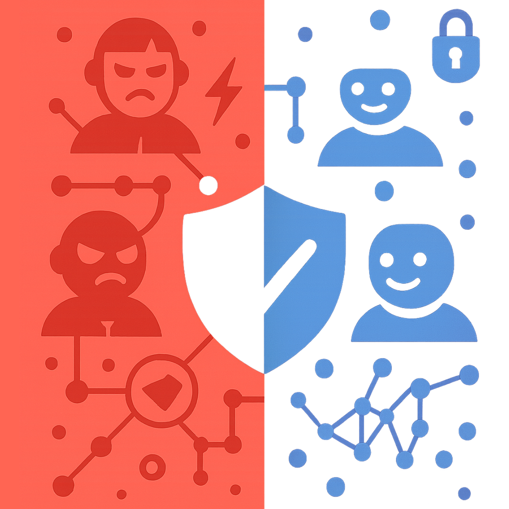

	

# Awesome Cybersecurity Agentic AI

## Table of Contents
- [MCP Servers](#mcp-servers)
- [Research](#research)
- [Tools](#tools)
- [Frameworks](#frameworks)
- [Datasets](#datasets)
- [Communities](#communities)

## MCP Servers
- [addcontent/nuclei-mcp](https://github.com/addcontent/nuclei-mcp) -  MCP server implementation for Nuclei, a fast and customizable vulnerability scanner.
- [alexgoller/illumio-mcp-server](https://github.com/alexgoller/illumio-mcp-server) - MCP server for Illumio PCE, enabling AI-driven workload management, label operations, and traffic flow analysis for security.
- [atomicchonk/roadrecon_mcp_server](https://github.com/atomicchonk/roadrecon_mcp_server) - MCP server for Azure AD data analysis with ROADRecon, mapping Azure Active Directory environments.
- [Bamimore-Tomi/ghidra_mcp](https://github.com/Bamimore-Tomi/ghidra_mcp) - MCP server for Ghidra, providing reverse engineering and binary analysis capabilities to LLMs and agentic workflows.
- [bromoket/x64dbg_mcp](https://github.com/bromoket/x64dbg_mcp) - MCP server for x64dbg debugger, providing 152 tools for AI-driven Windows debugging, reverse engineering, memory analysis, tracing, and anti-debug bypass.
- [BurtTheCoder/mcp-dnstwist](https://github.com/BurtTheCoder/mcp-dnstwist) - MCP server for DNS fuzzing with dnstwist, detecting phishing and domain takeover threats.
- [BurtTheCoder/mcp-maigret](https://github.com/BurtTheCoder/mcp-maigret) - MCP server for OSINT data collection with Maigret, gathering user info from various sources.
- [BurtTheCoder/mcp-shodan](https://github.com/BurtTheCoder/mcp-shodan) - MCP server for querying Shodan, providing data on Internet-connected devices for security analysis.
- [BurtTheCoder/mcp-virustotal](https://github.com/BurtTheCoder/mcp-virustotal) - MCP server for querying the VirusTotal API for file and URL malware analysis.
- [ExposureGuard/exposureguard-mcp](https://github.com/ExposureGuard/exposureguard-mcp) - Domain security scanning for AI agents. 8-check audit (SPF, DMARC, SSL, headers, DNSSEC, ports), A-F grades, fix snippets. [getexposureguard.com](https://getexposureguard.com)
- [ExposureGuard/haldir](https://github.com/ExposureGuard/haldir) - Guardian layer for AI agents: scoped sessions (Gate), encrypted secrets (Vault), audit trail (Watch), proxy mode for policy enforcement. Identity, spend limits, human-in-the-loop approvals. [haldir.xyz](https://haldir.xyz)
- [MCPPhalanx/binaryninja-mcp](https://github.com/MCPPhalanx/binaryninja-mcp) - MCP server for Binary Ninja, enabling binary analysis and reverse engineering in agentic workflows.
- [mobilehackinglab/jadx-mcp-plugin](https://github.com/mobilehackinglab/jadx-mcp-plugin) - Jadx plugin for MCP server access, used for decompiling Android apps.
- [MorDavid/BloodHound-MCP-AI](https://github.com/MorDavid/BloodHound-MCP-AI) - MCP server for BloodHound, providing Active Directory analysis and attack path discovery for agentic AI.
- [PortSwigger/mcp-server](https://github.com/PortSwigger/mcp-server) - MCP integration for Burp Suite, enabling web security testing and automation via agentic AI workflows.
- [san-techie21/astracipher](https://github.com/san-techie21/astracipher) - Cryptographic identity MCP server for AI agents using W3C DIDs, Verifiable Credentials, and NIST post-quantum cryptography (ML-DSA-65 FIPS 204). Provides capability-bounded tool authorization, trust chain verification, and hybrid PQC signatures.
- [urldna/mcp](https://github.com/urldna/mcp) - urlDNA MCP server for phishing detection and URL analysis through advanced contextual scanning.
- [voidly-ai/mcp-server](https://www.npmjs.com/package/@voidly/mcp-server) - Global internet censorship intelligence MCP server with 116 tools across 119+ countries. OONI / IODA / CensoredPlanet evidence, 5,356 citable incidents, ISP-level risk scoring, ML-driven shutdown forecasting (Sentinel), and domain accessibility checks for nation-state network interference. Free read endpoints, no API key.

## Research
- [AI CTF: Autonomous Agents in Cybersecurity Competitions](https://arxiv.org/abs/2311.09999) - Research on the use of agentic AI in CTF competitions and cybersecurity challenges.
- [AutoCTF: Automated Capture The Flag Framework](https://arxiv.org/abs/2306.00988) - Research on an automated CTF framework using agentic AI for autonomous penetration testing and vulnerability discovery.
- [BreachSeek](https://arxiv.org/html/2409.03789v1) - A Multi-Agent Automated Penetration Tester
- [CAI: An Open, Bug Bounty-Ready Cybersecurity AI](https://arxiv.org/abs/2504.06017) - Comprehensive research on an open-source agentic AI system for cybersecurity and in particular for bug bounty, featuring hierarchical agent patterns, multi-agent collaboration, and autonomous penetration testing capabilities.
- [CyberBattleSim (Microsoft)](https://github.com/microsoft/CyberBattleSim) - Research platform for simulating cybersecurity environments and evaluating autonomous agents in attack/defense scenarios.
- [D-CIPHER](https://arxiv.org/html/2502.10931v2) - A multi-agent framework for collaborative CTF solving.
- [Dynamic-Risk-Assessment](https://arxiv.org/abs/2505.18384) - Dynamic risk assessment specifically for offensive cybersecurity agents, offering insights into evaluating the risks and potential impact of autonomous attack tools.
- [LLM Agents for Automated Penetration Testing](https://arxiv.org/abs/2402.02444) - Paper on leveraging LLM-based agents for autonomous penetration testing and red teaming.
- [Multi-Agent Systems for Cybersecurity](https://arxiv.org/abs/2107.07229) - Survey and research on the application of multi-agent systems in cybersecurity, including threat detection and response.

## Tools
- [AgentFence](https://github.com/agentfence/agentfence) - Open-source platform for automatically testing AI agent security, detecting vulnerabilities like prompt injection, secret leakage, and system instruction exposure.
- [Agentic Radar](https://github.com/splx-ai/agentic-radar) - Open-source CLI security scanner for agentic workflows.
- [agenticsorg/agentic-security](https://github.com/agenticsorg/agentic-security) - An AI-powered security analysis tool intended to automatically detect vulnerabilities within code repositories.
- [Aguara](https://github.com/garagon/aguara) - Static security scanner for AI agent skills and MCP servers. 173 detection rules, 4 analysis layers (pattern matching, NLP, taint tracking, rug-pull detection), offline, deterministic.
- [AICA Agent](https://github.com/aica-iwg/aica-agent) - Autonomous intelligent cyberdefense agent for research and production, supporting advanced detection, response, and management capabilities.
- [brood-box](https://github.com/stacklok/brood-box) - CLI tool for running AI coding agents (Claude Code, Codex, OpenCode) inside hardware-isolated microVMs with snapshot isolation, egress control, and MCP authorization profiles.
- [`CAI` (Cybersecurity AI)](https://github.com/aliasrobotics/CAI) - Open-source Bug Bounty-ready AI system with hierarchical agentic patterns, supporting autonomous penetration testing, vulnerability discovery, and multi-agent cybersecurity workflows.
- [ClawSearch](https://clawsearch.com/) - Search engine for AI agent skills with security-first indexing, surfacing audit results, risk scores, and safe alternatives for MCP servers and agent tools.
- [ClawSec](https://clawsec.com/) - Security audit platform for AI agent skills with 5-tier analysis including static, dynamic, behavioral, Firecracker sandbox execution, and LLM-assisted review.
- [Dr.Binary](https://github.com/DeepBitsTechnology/claude-plugins) - The Plugin equips Claude Code with advanced binary analysis capabilities for tasks such as incident response, malware investigation, and vulnerability assessment. It connects to both cloud-based analysis platforms and local tools via MCP, enabling seamless hybrid workflows. With features including local Windows system scanning, browser hijacking detection, registry and network monitoring, suspicious file analysis, and remote binary analysis through tools like Ghidra, Qilin, and angr, the plugin transforms Claude Code into a powerful AI-assisted workspace for comprehensive system and binary security analysis.
- [Inkog](https://github.com/inkog-io/inkog) - Open-source AI agent security scanner. Audits agent code, MCP servers, and multi-agent delegation chains for vulnerabilities including prompt injection, infinite loops, and missing human oversight. Maps findings to EU AI Act, OWASP LLM Top 10, and OWASP Agentic Top 10. CLI + MCP server with SARIF output for CI/CD.
- [msoedov/agentic_security](https://github.com/msoedov/agentic_security) - An open-source vulnerability scanner specifically designed for Agent Workflows and LLMs, aiming to protect against issues like jailbreaks and fuzzing attacks.
- [OpenClaw Security Suite](https://github.com/AtlasPA/openclaw-security) - Open-source 11-tool security suite for AI agent workspaces covering integrity verification, secret scanning, prompt injection defense, supply chain analysis, network DLP, permission auditing, credential lifecycle, compliance enforcement, audit trails, cryptographic signing, and incident response. Pure Python stdlib, zero dependencies, fully local execution.
- [pentagi](https://github.com/vxcontrol/pentagi) - Fully autonomous AI-powered agent system designed for penetration testing.
- [Reaper](https://github.com/ghostsecurity/reaper) - Open Source Agentic Web App security testing and tampering tool by Ghost Security
- [ShellWard](https://github.com/jnMetaCode/shellward) - AI agent security middleware with 8-layer defense-in-depth — prompt injection detection (32 rules), DLP-style data flow tracking (read PII → outbound send = blocked), dangerous command blocking, PII/API key scanning. Works as SDK or OpenClaw plugin. Zero dependencies.
- [Vulert](vulert.com) - Vulert secures software by detecting vulnerabilities in open-source dependencies—without accessing your code. It supports Js, PHP, Java, Python, and more

## Frameworks
- [Agno](https://github.com/agno-agi/agno) - Lightweight, high-performance library for building Agents.
- [ATFAA/SHIELD](https://arxiv.org/abs/2504.19956) - Advanced threat and mitigation frameworks for securing generative/agentic AI agents, with a focus on unique agent vulnerabilities and enterprise security.
- [CrewAI](https://github.com/crewAIInc/crewAI) - Open-source framework for orchestrating teams of AI agents, supporting collaborative and specialized agentic workflows in security contexts.
- [LangChain](https://github.com/langchain-ai/langchain) - Modular framework for building LLM-powered agentic workflows, including security automation, retrieval-augmented generation, and tool integration.
- [LangGraph](https://github.com/langchain-ai/langgraph) - Graph-based extension of LangChain for advanced state management and multi-agent workflows, suitable for cybersecurity automation.
- [MAESTRO (CSA)](https://cloudsecurityalliance.org/blog/2025/02/06/agentic-ai-threat-modeling-framework-maestro) - Threat modeling framework for agentic AI, focusing on multi-agent security, layered risk analysis, and secure agentic system design.
- [Microsoft AutoGen](https://github.com/microsoft/autogen) - Framework for orchestrating multi-agent systems, enabling collaborative AI agents for complex cybersecurity and automation tasks.
- [Microsoft Semantic Kernel](https://github.com/microsoft/semantic-kernel) - Context-aware agentic AI framework for integrating semantic reasoning and automation in security operations.

## Datasets
- [CICIDS 2017/2018](https://www.unb.ca/cic/datasets/) - Realistic network traffic datasets with labeled attacks for developing and benchmarking agentic cybersecurity solutions.
- [CTF Datasets (DEF CON, CSAW, PicoCTF, etc.)](https://github.com/ctfs/write-ups-2014#datasets) - Real-world and simulated Capture The Flag (CTF) challenges and solutions for agentic AI and automated penetration testing research.
- [CyberBattleSim Dataset](https://github.com/microsoft/CyberBattleSim) - Synthetic cybersecurity environments and logs for training and evaluating autonomous agents in attack/defense scenarios.
- [DARPA Transparent Computing Datasets](https://drive.google.com/drive/folders/1okt4AYElyBohW4XiOBqmsvjwXsnUjLVf) - Large-scale, labeled system event data for red/blue team cyber operations, suitable for multi-agent and autonomous defense research.
- [UNSW-NB15](https://research.unsw.edu.au/projects/unsw-nb15-dataset) - Network traffic and labeled attack data for training and evaluating AI-based intrusion detection and response agents.

## Learning Resources/Podcast
- [Agentic Security Newsletter](https://agenticsecurity.substack.com/) - A Newsletter that explores how autonomous, AI-driven agents are reshaping both offensive and defensive security. Each issue dives into the latest in tactics, tools, and ideas defining the future of security.
- [AI Security Podcast](https://www.aisecuritypodcast.com/) - Interviews with CISOs of Anthrophic, DeepMind and more doing amazing work in LLM and cybersecurity. Topics include Agentic AI, Red Team with AI, AI for Security and Security from AI & more. The show is hosted by 2 former CISOs and currently has the largest CISO & Tech Leader audience for AI Security.
- [awesome-ai-agents](https://github.com/e2b-dev/awesome-ai-agents) - A curated list of AI autonomous agents. While not exclusively cybersecurity focused, it's a valuable resource for discovering emerging frameworks and platforms that could be adapted for security purposes.

## Communities
- *Submit your awesome Agentic AI Cybersecurity community here!*

---

*Contributions welcome! See [contributing guidelines](CONTRIBUTING.md) for details.*
